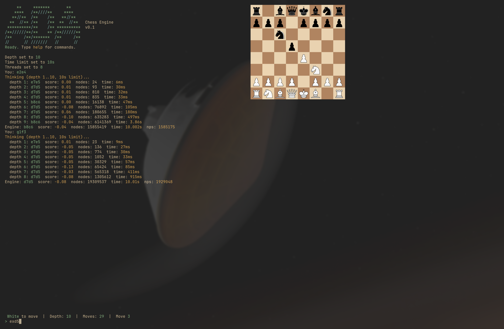

# Ada Engine

A chess engine written from scratch in Go — the rules, the move-picking, and a terminal app to play it, all built here with no chess libraries.



## Play

```
go run ./ada-tui
```

Type a move like `e4` or `e2e4`, and the engine replies. Type `help` for the full command list.

The board is drawn as an image, so use a terminal that supports the Kitty graphics protocol (Kitty, Ghostty, WezTerm).

## What's inside

- **ada-chess** — the rules of chess: the board, legal moves, and reading/writing standard game notation.
- **ada-search** — the brain: looks ahead through possible moves and picks the best one it can find within a time limit, using all your CPU cores.
- **ada-tui** — a terminal app to play against the engine, or watch it play itself.

## Tree search

Chess engines don't reason about strategy — they search. The engine builds a tree of possible futures: every move it could make, every reply, every answer to that, several moves deep. The number of positions explodes exponentially, so most of the work is deciding what *not* to explore.

- **Pruning (alpha-beta).** The engine walks the tree assuming both sides play their best. Once a branch is proven worse than an option already in hand, the rest of that branch is skipped without being searched — this cuts the tree down enough to look many moves ahead.
- **Resolving captures first (quiescence).** At the depth limit, positions get scored (see [Evaluation](#evaluation)) — but scoring mid-capture-exchange gives absurd results, like judging a trade after you've paid but before you've been paid. So the engine first extends the branch through any remaining captures until the position is quiet.
- **Caching (transposition table).** Different move orders often lead to the same position. Each position gets a hash, and results are stored in a shared table so previously-solved positions are looked up instead of re-searched.
- **Iterative deepening.** The engine searches 1 move deep, then 2, then 3, restarting each time. This sounds wasteful but isn't: each pass's results are cached and used to try the best moves first in the next pass, which makes pruning far more effective. When the time limit hits, it plays the best move from the last completed pass.
- **Parallel search (Lazy SMP).** Multiple threads search the same tree at once, coordinating only through the shared cache — nearly zero synchronization overhead, and the threads naturally spread out across the tree.

### Generating moves (magic bitboards)

The search visits millions of positions, and at every one it must list the legal moves — so move generation has to be fast. The board is stored as *bitboards*: 64-bit integers with one bit per square, so questions like "which squares are occupied?" are single CPU instructions. For knights and kings, moves depend only on the square they're standing on, so a 64-entry lookup table covers everything.

Rooks, bishops, and queens are harder: how far they slide depends on what's in the way. The engine precomputes the answer for *every possible arrangement* of blocking pieces along each square's lines. The trick to looking those answers up is a perfect hash: take the occupied squares along the piece's lines, multiply by a specially chosen "magic" 64-bit constant that happens to map every arrangement to a unique table slot, and read out the move set — one multiply, one shift, one array access. The magic constants are found by random trial when the engine starts up.

The implementation is in [`ada-chess/movegen/magic.go`](ada-chess/movegen/magic.go). For a deeper walkthrough of the technique, see [Magical Bitboards and How to Find Them](https://analog-hors.github.io/site/magic-bitboards/).

## Evaluation

At the bottom of the tree, each position gets reduced to a single number. The evaluation here ([`ada-search/eval.go`](ada-search/eval.go)) is deliberately simple: count material (queen = 9 pawns, rook = 5, and so on), then add small bonuses for pieces that are advanced, near the center, or grouped up around the enemy king. That's the whole thing — no pawn-structure analysis, no mobility counting, none of the hundreds of terms serious engines use.

The surprise of this project was how strong that is. Depth does the heavy lifting: forks, pins, winning trades, and even play that looks strategic all emerge from searching deeply with a crude score, not from a clever score. A simple evaluation searched deep beats a sophisticated one searched shallow — the score only has to point in roughly the right direction, and the search does the rest.
